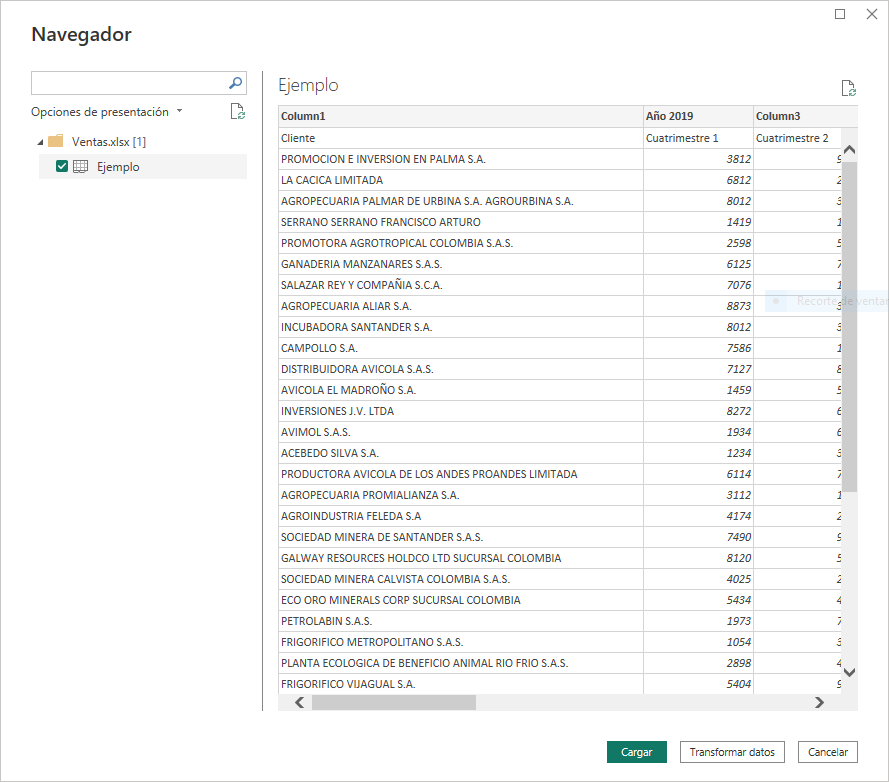
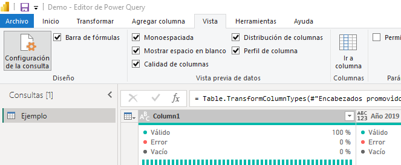
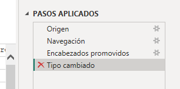
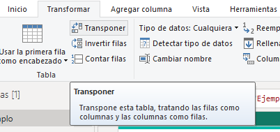
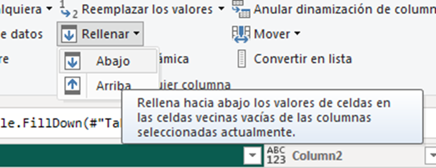
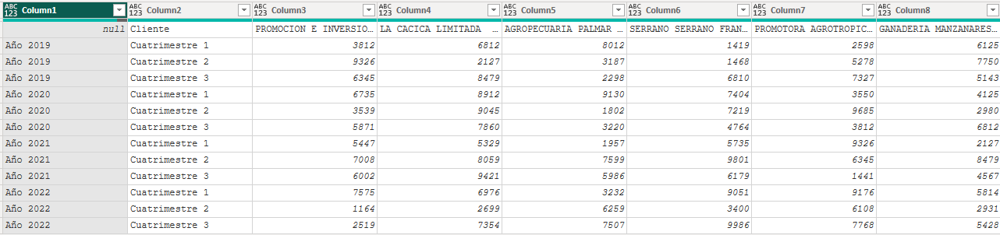
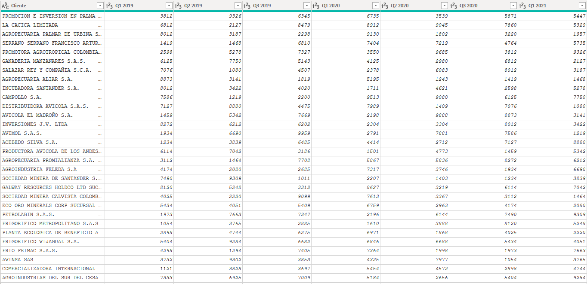
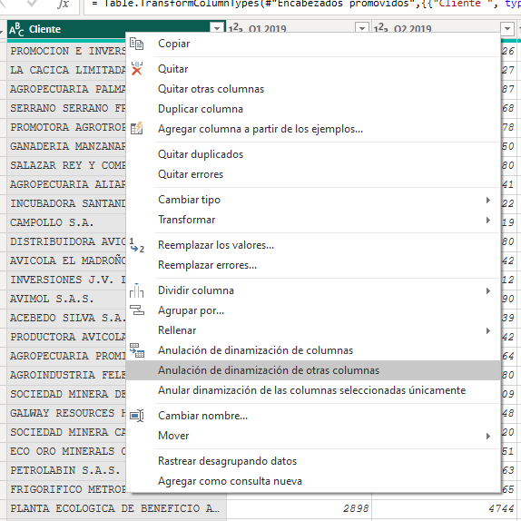

# Práctica 1. Transformación

## Objetivo de la práctica:
Al finalizar la práctica, serás capaz de:
- Utilizar herramientas perfilado y visualización de datos para analizar y comprender los datos importados.
- Explorar y experimentar con diferentes herramientas y opciones disponibles en Power Query para personalizar y optimizar el proceso de transformación de datos.

## Duración aproximada:
- 45 minutos.

## Instrucciones 

**Planteamiento:** Un analista de datos practicante en la empresa “Armana” necesita analizar las ventas de los últimos 4 años. Se le proporcioa un archivo de Excel con las ventas y se le solicita preparar los datos para crear visualizaciones posteriormente. Sin embargo, el archivo requiere varias transformaciones antes de poder trabajarlo.

> ***Nota:** Para completar este ejercicio, use el archivo que se encuentra en el repositorio de datos del curso “Ventas” de formato .xls.*

### Tarea 1. Obtención de datos.
1. Abrir **Power BI Desktop** y crear un informe en blanco.
2. Seleccionar la pestaña Inicio de la cinta de opciones y hacer clic en **Obtener datos > Libro de Excel**.
3. Buscar la ruta del archivo (**Ventas.xlsx**) y hacer clic en aceptar. Aparecerá una ventana con una previsualización de los datos. 
4. Seleccionar la tabla ejemplo y dar clic en **“Transformar datos”**.

    

### Tarea 2. Inspección de datos
1. Usar las herramientas de generación de perfiles de datos y la ventana de visualización para conocer los datos.
2. En la pestaña **Vista**, activar las opciones **“Calidad de columnas”**, **“Distribución de columnas”** y **“Perfil de columnas”**.
3. Puede desactivarlos una vez que haya obtenido sus conclusiones.

    

### Tarea 3. Eliminar pasos automáticos
Por defecto, Power Query intentará actualizar automáticamente los tipos de datos y encabezados, pero la forma del archivo fuente hace que en esta ocasión eso no sea algo deseado. 

1. En el panel **Confiuración de la consulta**, eliminar los pasos automáticos aplicados: **“Encabezados promovidos”** y **“Tipo cambiado”** dando clic a la **"X"** que se encuentra a la izquierda de cada paso.

    

### Tarea 4. Replicar años para el resto de los cuatrimestres
En el archivo original, se usaron celdas combinadas para etiquetar los años, pero esto no es algo soportado en Power Query. Ante esto, se debe rellenar las casillas que quedaron sin año con el año correspondiente. 

1. Dar clic en la opción **Transponer** de la pestaña **Transformar** de Power Query.
    

2. Seleccionar la columna donde quedaron los años y en la pestaña **Transformar**, dar clic a **Rellenar > Abajo**. De esta manera las casillas se replicarán hacia abajo. 
    

3. Al aplicar las transformaciones anteriores se tendrá lo siguiente:
    

### Tarea 5. Quitar palabra ""Año" de las casillas
Se quitará la palabra "Año" de la columna 1 (Column1) para que sólo quede el año. 

1. En la pestaña **Transformar** de Power Query, dar clic en **“Extraer > Texto después del delimitador”**. 

2. En este caso se tiene la palabra "Año" y el año, en sí están separados por un delimitador (espacio). En la ventana **"Texto después del delimitador"** ingresar un **espacio** como delimitador y dar clic en “Aceptar”.

    

### Tarea 6. Reemplazar la palabara "Cuatrimestre" por "Q"
En la columna en donde quedaron los cuatrimestres solicitan que el formato fuese "Q1", "Q2", "Q3".
1. Seleccionar la columna 2 (Column2) y en la pestaña **Transformar** seleccionar **“Reemplazar los valores”**. 
2. En la ventana emergente reemplazar **“Cuatrimestre ”** por **"Q"** y dar clic en “Aceptar”.

    

### Tarea 7. Concatenar "Año" y "Cuatrimestre"
Fusiona las columnas de **"Año"** y **"Cuatrimestre"** en una nueva columna. 

1. Seleccionar ambas filas con la tecla "CTRL" y dar clic derecho al nombre de una columna. 
2. Seleccionar **“Combinar columnas”**.
3. Seleccionar **“Espacio”** como separador e ingresar **“Año Cuatrimestre”** como nuevo nombre. Por último, dar clic en “Aceptar”.

    

### Tarea 8. Usar primera fila como encabezado

Antes de modificar el encabezado, dar clic una vez más en **"Transponer"** para tener la tabla en el sentido original.

1. Ahora, cuenta con las casillas "año" y "Cuatrimestres" unidas, en la pestaña **Transformar** de Power Query, seleccionar la opción: **"Usar la primera fila como encabezado"**.

    

### Tarea 9. Normaliza Tabla
Al terminar este proceso puede normalizar la tabla. 
1. Para ello, seleccionar la columna **Cliente**, dar clic derecho en su nombre y seleccionar **“Anulación de dinamización de otras columnas”**.

### Resultado esperado
La tabla ha sido transformada a un formato mucho más funcional, lo que facilitará considerablemente la creación de relaciones y visualizaciones en el futuro. Se sugiere dividir la columna “Atributo” en dos, separando los Cuatrimestres y el Año, para permitir una mejor normalización y simplificar la creación de relaciones con dichas columnas en etapas posteriores. Power Query ofrece una amplia gama de herramientas que se pueden dominar mediante la práctica con diferentes conjuntos de datos y la comprensión de su aplicación en distintos escenarios. En esta ocasión, los datos se presentan de la siguiente manera:

