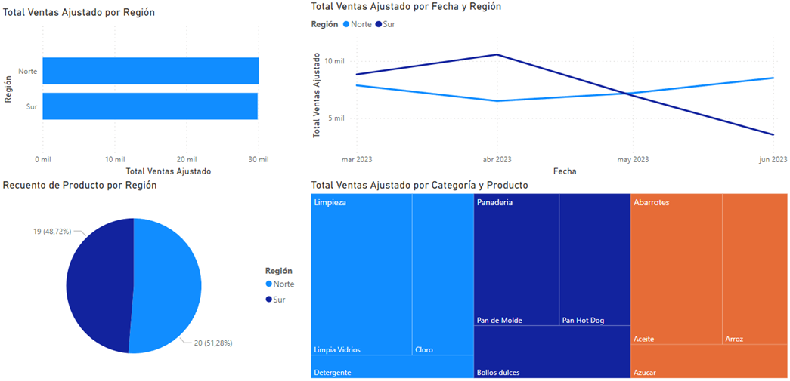
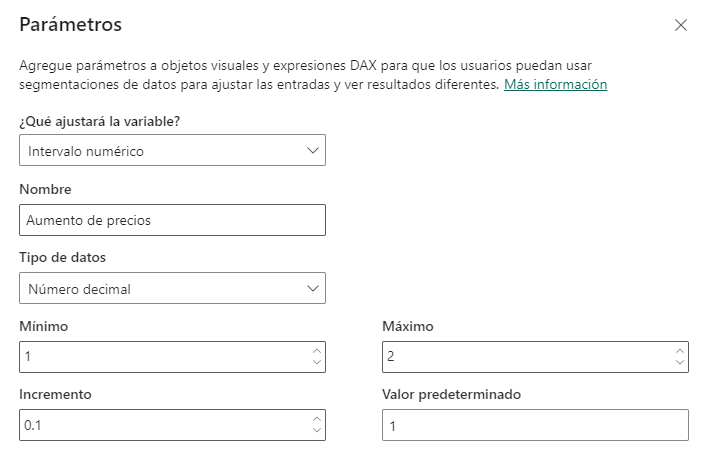
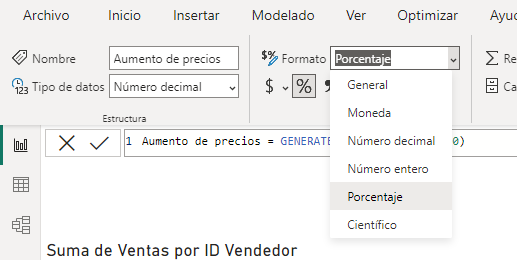
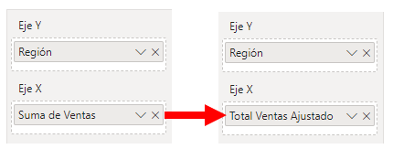
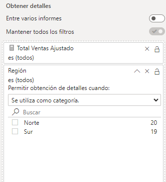
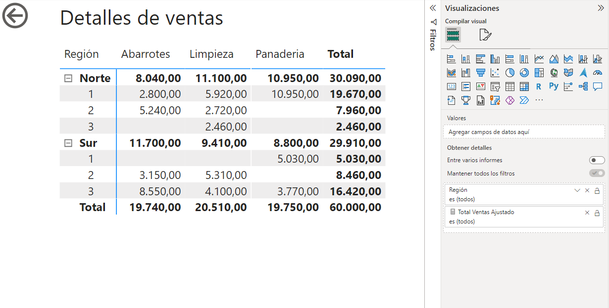
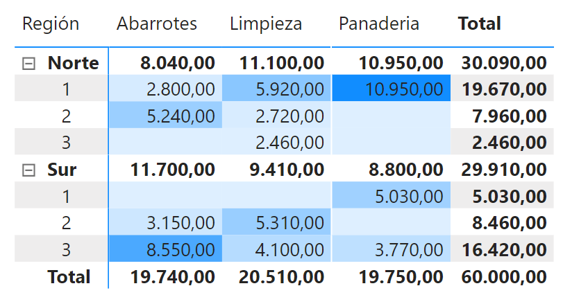

# Práctica 2. Visualización

## Objetivo de la práctica:
Al finalizar la práctica, serás capaz de:
- Crear visualizaciones.
- Aplicar análisis "What If" mediante la adición de un parámetro para simular incrementos en las ventas de la región Norte y ajustar las visualizaciones de manera dinámica.
- Aplicar filtros interactivos mediante el uso de segmentadores o listas desplegables para permitir a los usuarios filtrar los datos por región y categoría de productos.
- Configurar la funcionalidad Drillthrough creando una nueva página con detalles de ventas, utilizando una matriz para mostrar las ventas por región, vendedor y categoría.
- Aplicar formateo condicional en la matriz de detalles de ventas para resaltar visualmente los valores importantes o destacar tendencias.

## Duración aproximada:
- 60 minutos.

## Instrucciones 
Un analista de datos necesita generar visualizaciones descriptivas e interactivas para analizar las ventas de una tienda minorista por región y categoría
>***Nota:** Para completar este ejercicio, usa el archivo que se encuentra en el repositorio de datos del curso **“Ventas por región”** de formato .xls.*

### Tarea 1. Importar datos y crear un informe básico

1. Importar a Power BI el archivo **Ventas por región.xlsx** con datos de ventas. 
    >***Nota:** En esta oportunidad los datos están limpios. Verificar que el nombre de la consulta sea **Ventas** y que los tipos de datos sean correctos.* 
2. Utilizar las herramientas de generación de perfiles de datos para conocer rápidamente la calidad, composición y estructura de los mismos.

### Tarea 2. Crear visualizaciones
Se requiere generar visualizaciones que permitan analizar las ventas y comparar la demanda de productos por región:
1. Crear un **gráfico de barras apiladas** que muestre las ventas por región:
    - **Eje X:** Suma de Ventas.
    - **Eje Y:** Región.
2. Crear un **gráfico de líneas** que muestre las ventas mensuales por región: 
    - **Eje X**: Fecha.
    - **Eje Y:** Suma de Ventas.
    - **Leyenda:** Región.
3. Crear un **gráfico circular** que muestre los productos vendidos por región:
    - **Leyenda:** Región.
    - **Valores:** Recuento de producto.
4. Crear un **treemap** que muestre las ventas totales por producto diferenciadas por categoría:
    - **Categoría:** Categoría.
    - **Detalles:** Producto.
    - **Valores:** Suma de Ventas.

    

### Tarea 3. Aplicar análisis "What If"
El análisis "What If" permitirá simular aumentos en las ventas de la región Norte mediante un control deslizante.

1. Ir a la pestaña **Modelado** y seleccionar **“Parámetro nuevo > Intervalo numérico”** para crear un **Parámetro** 
2. Usar la siguiente configuración para generar un control deslizante que vaya desde el 100% **(valor normal)** al 200% **(valor al doble del original)**:

    - **¿Qué ajustará la variable?:** Intervalo númerico
    - **Nombre:** Aumento de precios
    - **Tipo de datos:** Número decimal
    - **Mínimo:** 1
    - **Máximo:** 2
    - **Incremento:** 0.1
    - **Valor Predeterminado:** 1

    

    >***Nota:** Esto creará por defecto el control deslizante que de momento no genera cambios en las visualizaciones.* 

Estos pasos también generan una nueva tabla en el panel de datos llamada como el parámetro recien creado **("Aumento de precios")** y una medida que contiene el valor actual del parámetro en el control deslizante **("Valor de Aumento de precios")**. Esta medida debe utilizarse en las visualizaciones para poder ver cambios en ellas.

3. Seleccionar el campo **“Aumento de precios”** y en la pestaña **“Herramientas de columnas”** cambiar el formato de **"General"** a **"Porcentaje"**. 

    

Ahora se crea una nueva medida DAX en la tabla **Ventas** que ajuste las ventas de la región Norte según el control deslizante:

4. Seleccionar **“Nueva Medida”** en la pestaña **"Inicio"**. Se desplegará el panel para ingresar la siguiente medida:
        
        Total Ventas Ajustado = SUM(Ventas[Ventas]) * IF(MAX(Ventas[Región]) = "Norte", [Valor de aumento de precios], 1)

    >***Nota:** La medida multiplica la suma de Ventas por el valor del control deslizante sólo cuando la región es Norte, de lo contrario se mantiene el valor original.*

5. Modificar las visualizaciones creadas, reemplazar donde se ha usado **“Suma de Ventas”** por **“Total Ventas Ajustado”**.
    > ***Nota:** Con estos cambios, al mover el control deslizante verá que todas las visualizaciones se modifican según el porcentaje de aumento de precios para la región norte.*

    

### Tarea 4. Aplicar filtros interactivos
Agregar segmentadores o listas desplegables al informe permite a los usuarios filtrar los datos según diferentes dimensiones. En este caso es útil segmentar por los campos **región** y **producto**.

1. Añadir dos objetos visuales de **Segmentación** de datos y usar los valores a filtrar como campo.
2. Dar formato al objeto visual. En el panel de **Visualizaciones** en la pestaña **Dar Formato a su objeto visual** dar clic en **Configuración de la segmentación**. Puede elegir entre:
    - Lista vertical
    - Mosaico
    - Menú desplegable.
 
Es importante asegurarse de que los filtros aplicados afecten a todas las visualizaciones relevantes en el informe seleccionando el segmentador. 

3. En la pestaña **Formato**, seleccionar **Editar interacciones**. Esto habilitará unos iconos en la esquina superior derecha de cada visualización que dará la opción de interactuar o no con ésta.

   
### Tarea 5. Configurar Drillthrough

1. Crear una nueva página que se utilizará para obtener detalles de Ventas. 
2. Crear un objeto visual de **matriz** que detalle las ventas por región, subdividido por Vendedores y Categorías:
    - **Filas:** región, ID Vendedor.
    - **Columnas:** Categoría.
    - **Valores:** Total Ventas Ajustado. 
3. En la parte inferior del panel **Visualizaciones**, en el espacio destinado a **agregar los campos de obtención de detalles (Drillthrough)**, ingresar la medida **Total de Ventas ajustado** por defecto y el campo **Región** como categoría.

    

En este caso sólo se usará esta visualización, personalizar el tamaño de la página ayuda a no quedar con tanto espacio en blanco. Para ello, dar clic en una sección en blanco de la página y seleccionar **Formato de página**.

4. En la sección **configuración de lienzo**, seleccionar el **Tipo: personalizado**. Adaptar el tamaño de la página a la visualización (Alto: 300px y Ancho: 450px). Renombrar la página como **Detalles de ventas**. 

   

8. Probar la opción de **Obtención de detalles**. Hacer clic derecho a un punto del gráfico de líneas en la **página 1** y aparecerá la opción **Obtener detalles > Detalles de ventas**. 
    > ***Nota:** La acción llevará a la página de detalles, filtrando la región y fecha en el que se puso el puntero.*

### Tarea 6. Aplicar formateo condicional

Utilizar el formato condicional ayuda a resaltar visualmente los valores importantes o destacar tendencias en las visualizaciones. 
1. Seleccionar el objeto visual **matriz**, en el panel de **Visualizaciones > De formato a su objeto visual**, buscar la opción **Elementos de celda**. 
2. Activar la opción **color de fondo** con los ajustes por defecto. Con esta configuración se podrá ver rápidamente los valores más altos. 
7. En la opción **(fx) - formato condicional** puede personalizar los colores y límites según los valores mínimos y máximos.

    

### Resultado esperado
Al completar la práctica, se habrá generado un informe con visualizaciones dinámicas e interactivas que permitan analizar la situación de ventas de la tienda minorista. Estas visualizaciones podrán personalizarse con temas, marcadores o configuraciones adicionales para mejorar su presentación. 

