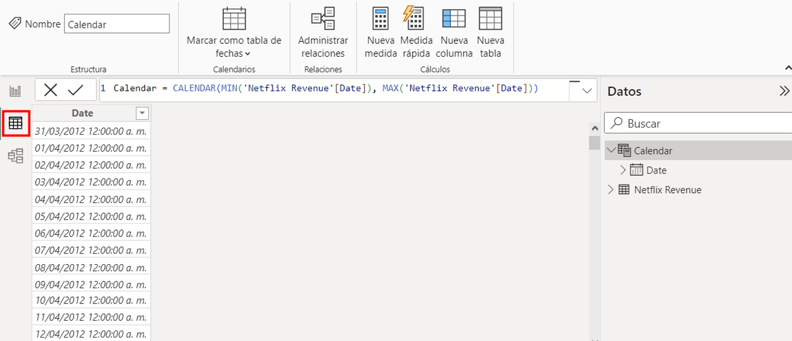
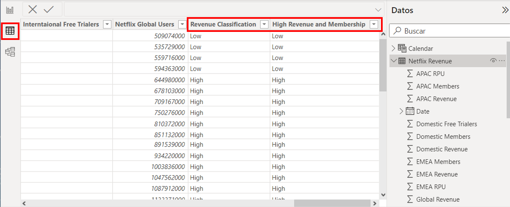
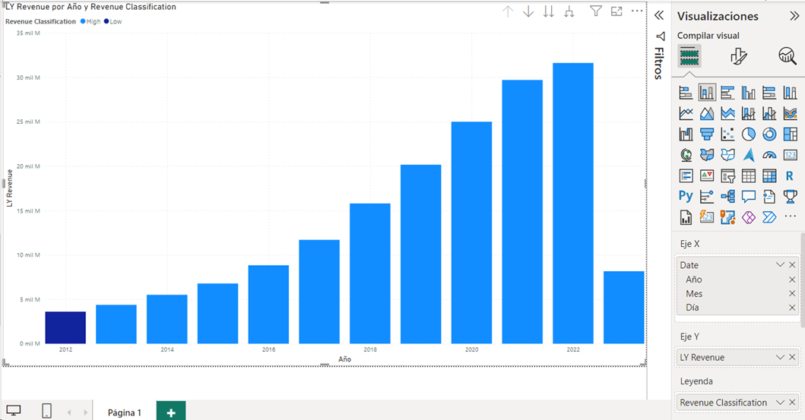
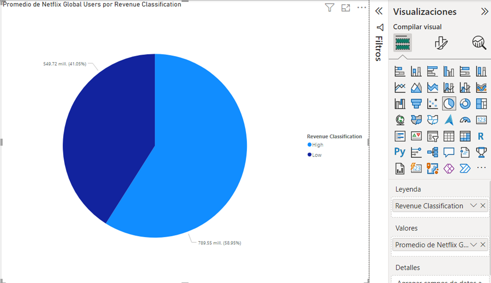
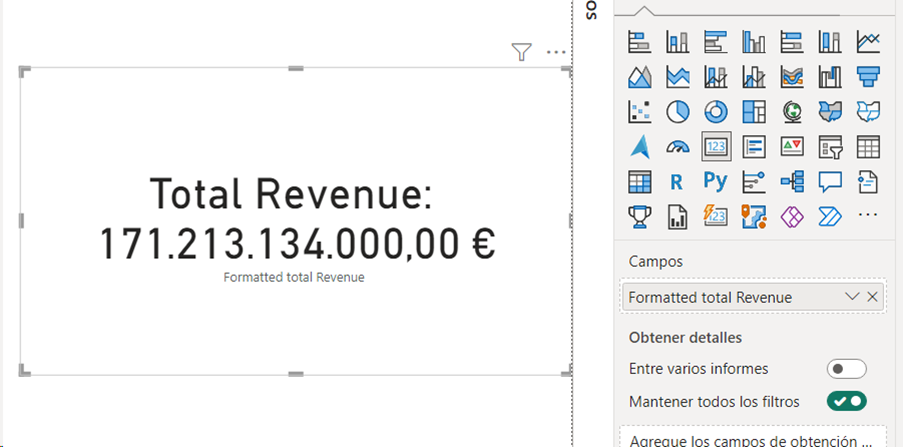
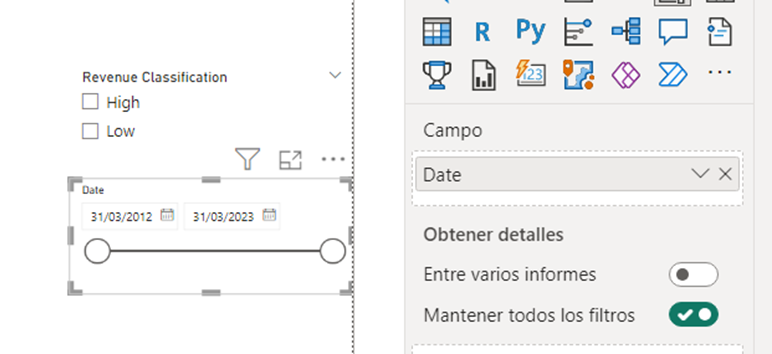

# Práctica 3. DAX

## Objetivo de la práctica:
Al finalizar la práctica, serás capaz de:
- Utilizar funciones de cálculo DAX para clasificar, filtrar y calcular valores en un conjunto de datos
- Utilizar funciones de Time Intelligence y texto para realizar comparaciones y generar medidas descriptivas.

## Duración aproximada:
- 60 minutos.

## Instrucciones 

**Descripción:** En esta oportunidad se presenta un conjunto de datos que contiene los ingresos de la empresa Netflix en dólares y el número de suscriptores pagos por región. Se aplicarán diversas funciones DAX para realizar análisis y generar medidas que aporten valor al reporte.

>***Nota:** Para completar este ejercicio, use el archivo que se encuentra en el repositorio de datos del curso “Netflix Revenue” de formato .csv.*

### Tarea 1. Importar los datos.
1. Iniciar Power BI Desktop. En la pestaña **Inicio** seleccionar **“Obtener datos” > “Texto/CSV”**.
2. Navegar hasta el archivo **Netflix Revenue.csv** y dar clic en **Abrir**.
3. En la ventana **Navegador**, podrá visualizar una vista previa de los datos. Hacer clic en **Transformar datos** y, en la columna **Netflix Global Users**, eliminar las **comas** de los valores y aplicar el formato de **número entero** antes de importar los datos.

### Tarea 2. Crear una tabla de calendario

1. En la pestaña **Modelado**, seleccionar **Nueva tabla**.
2. Introducir la siguiente fórmula DAX para crear una tabla de calendario basada en el rango de fechas del conjunto de datos:

        Calendar = CALENDAR(MIN('Netflix Revenue'[Date]), MAX('Netflix Revenue'[Date]))
    >***Nota:** Visualizar el resultado de la tabla calendario, seleccionando la **vista de tabla** en el panel izquierdo*.

    

### Tarea 3. Condicionales

1. Crear una nueva columna en la tabla **Netflix Revenue** para clasificar los ingresos globales como altos o bajos usando condicional IF: 
   
        Revenue Classification = IF('Netflix Revenue'[Global Revenue] > 1000000000, "High", "Low")

### Tarea 4. Operadores Lógicos

1. Crear una columna para clasificar ingresos altos cuando la membresía doméstica supera los 5,000,000. Usará el operador lógico AND para esta tarea: 

        High Revenue and Membership = IF(AND('Netflix Revenue'[Global Revenue] > 1000000000, 'Netflix Revenue'[Domestic Members] > 5000000), "High", "Low")

2. Validar las nuevas columnas visualizándolas en la vista de tabla.
        

### Tarea 5. Funciones de cálculo filtrado
1. Crear una medida para calcular el total de ingresos globales cuando la clasificación de ingresos es "High":

        High Revenue Total = CALCULATE(SUM('Netflix Revenue'[Global Revenue]),'Netflix Revenue'[Revenue Classification] = "High")

### Tarea 6. Funciones iteradores

1. Utilizar la función SUMX para calcular los ingresos totales de la región UACN divididos por la cantidad de miembros en la misma región. Hacer clic con el botón derecho en la tabla **Netflix Revenue**, seleccionar **Nueva medida**:

        Revenue UACN Members = SUMX('Netflix Revenue', 'Netflix Revenue'[UACN Revenue] / 'Netflix Revenue'[UACN Members])

### Tarea 7. Funciones de tabla y filtro
1. Utilizar la función ALL para eliminar cualquier filtro en los ingresos globales. Hacer clic con el botón derecho en la tabla **Netflix Revenue**, seleccionar **Nueva medida**:

        Total Revenue = CALCULATE(SUM('Netflix Revenue'[Global Revenue]), ALL('Netflix Revenue'))

### Tarea 8. Funciones con variables
1. Crear una medida que utiliza una variable para calcular el ingreso global total y luego evalúa si ese valor es mayor a 1,000,000,000. Según el resultado de la evaluación, devuelve "High" o "Low":

        Measure with Variable =
        VAR TotalRevenue = SUM('Netflix Revenue'[Global Revenue])
        Return
        IF(TotalRevenue > 1000000000, "High","Low")

### Tarea 9. Funciones de Time Intelligence
1. Usar la función **SAMEPERIODLASTYEAR** para comparar los ingresos de este año con los del año pasado. Hacer clic con el botón derecho en la tabla **Netflix Revenue**, seleccionar **Nueva medida**:

        LY Revenue = CALCULATE(SUM('Netflix Revenue'[Global Revenue]), SAMEPERIODLASTYEAR('Calendar'[Date]))

### Tarea 10. Funciones de texto

1. Usar la función CONCATENATE para combinar texto. Hacer clic con el botón derecho en la tabla **Netflix Revenue**, seleccionar **Nueva medida**:

        Formatted total Revenue = CONCATENATE("Total Revenue:", FORMAT([Total Revenue], "Currency"))

### Tarea 11. Creación de visualizaciones

Las medidas que son creadas aparecen en el panel **"Datos"** con un ícono de calculadora. Las medidas se usan en algunos de los análisis de datos más comunes, los resultados calculados de las medidas cambian constantemente en respuesta a la interacción con los informes, lo que permite la exploración rápida y dinámica de datos ad hoc.

1. **Gráfico de columnas:** Usar la medida **LY Revenue** en el **eje Y** y la columna **Date** en el **eje X** para comparar los ingresos por año, diferenciando por **Revenue Classification** en la **leyenda**.

    

2. **Gráfico circular:** Representar el promedio de suscriptores globales (**Netflix Global Users**) en **valores** y **Revenue Classification** como **leyenda**.

    

3. **Tarjeta:** Mostrar la medida **Total Revenue** en una visualización de tarjeta con formato amigable.

    

4. **Segmentación de datos:** Añadir segmentadores para categorías como **Revenue Classification** y fechas (**Date**) para analizar interacciones.

    

Probar otras combinaciones e intentar extraer conclusiones de los datos y evalúar que otras medidas podrían ser de utilidad. Guardar proyecto de Power BI. 

### Resultado esperado
Se ha Explorado diversas funciones de DAX, creando medidas y columnas calculadas que permiten un análisis detallado y dinámico de los datos. Además, aprenderá a utilizar estas medidas en visualizaciones interactivas, mejorando la presentación y el análisis de los datos de Netflix.

El lenguaje DAX es extenso y esta práctica sirve como introducción a su aplicación. Se recomienda continuar explorando funciones avanzadas para maximizar el potencial de Power BI.

