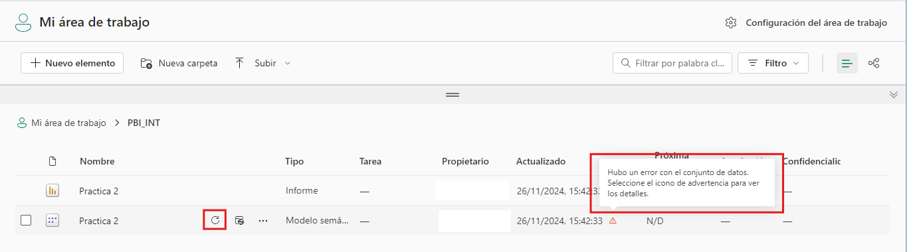
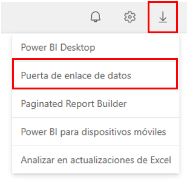

# Práctica 4. Seguridad, administración y Power BI Service

## Objetivo de la práctica:
Al finalizar la práctica, serás capaz de:
- Configurar la seguridad a nivel de filas en Power BI, estableciendo roles y reglas que limiten el acceso a los datos según las definiciones de seguridad.
- Comprender y aplicar la configuración de un Gateway para permitir la actualización automática de informes en Power BI Service con datos locales.

## Duración aproximada:
- 45 minutos.

## Instrucciones 

**Descripción:** Utilizar el reporte creado en el capítulo 2 para aplicar los conceptos revisados en este capítulo de Seguridad, administración y Power Bi Service.

>***Nota:** Para completar este ejercicio, use el archivo que se encuentra en el repositorio de datos del curso “Practica 2” de formato .pbix.*

### Tarea 1. Definición de roles y reglas.
1. Abrir el reporte **Practica 2.pbix**.
2. Verificar que la fuente de datos sea la correcta:
    - Ir a **Transformar datos > Configuración de origen de datos**.
    
    - Hacer clic en **Cambiar origen** y localizar el archivo **Ventas por región.xlsx** en el repositorio. Actualizar la ruta y guardar los cambios. 
    

3. Ir a la pestaña de **modelado** y seleccionar **“Administrar Roles”**.
4. Crear los siguientes roles: 
    - **Administrador:** Visualizar todos los datos (no requiere filtros adicionales). Renombrar el rol como **"Administrador"**.
    - **Región Norte:** Renombrar el rol como **“Región Norte”**, seleccionar la tabla de **Ventas**, En el panel **Filtrar Datos** dar clic en **Nuevo**. Configurar: 
        - **Columna:** Región (Parámetro por el que se desea filtrar)
        - **Condición:** Es igual A
        - **Valor:** Norte
    
    - **Región Sur:** Filtrar la tabla Ventas con la condición DAX: **[Región] = "Sur"**. 
     
    
5. Guardar los roles creados.

### Tarea 2. Validar Roles en Power BI Desktop
1. Para validar que los roles quedaron bien configurados, seleccionar la opción **“Ver como”** en la pestaña **Modelado** de Power BI Desktop. 
2. Seleccionar el rol **“Región Norte”** y asegurese de ver únicamente los datos de esa región.
    >***Nota:** Dirijase a la vista de datos y revise la tabla **Ventas**. También se aplicará esta configuración.*

### Tarea 3. Administración de la seguridad de Power BI Service
1. Teniendo los roles listos, en la pestaña **Inicio** dar clic a **Publicar** y seleccionar **“Mi área de trabajo”**. 
2. Hacer clic en el enlace **“Abrir Practica 2.pbix en Power BI”** lo llevará directamente al reporte en Power BI Service.
3. En el panel de la izquierda en Power BI Service seleccionar **“Mi área de trabajo”**; Verá dos veces el nombre de **“Practica 2…”**, el conjunto de datos y el informe.
4. Dar clic a los tres puntos a la derecha del nombre del conjunto de datos y seleccionar **Seguridad**. 

    

5. Al lado izquierdo apareceran todos los roles configurados previamente y al lado derecho podrá añadir a las personas o grupos del rol que tenga seleccionado.
6. Añadir a algunos de los compañeros del curso o al instructor en los roles.

    

### Tarea 4. Configurar Gateway
Una vez configurada la seguridad a nivel de filas, es posible configurar el Gateway. En palabras simples, el Gateway es un programa que se instala en una computadora y permitirá actualizar informes que estén en Power BI Service con datos que tenga localmente en el equipo.
1. Comprobar el estado actual de la actualización de datos:
    - Regresar al área de trabajo y, en el archivo del conjunto de datos, intente **actualizar**. Si se produce un error, esto indica que no se ha configurado un Gateway para acceder a los datos locales.
    
2. Para comenzar con el proceso de configurar el Gateway, dar clic a los tres puntos del conjunto de datos del reporte y seleccionar **Configuración**, en donde se desplegará una nueva pantalla con diversas opciones.

    
3. En la segunda opción desplegable encontrará la opción **“Conexiones de puerta de enlace”**, al desplegarla le indicará que no tiene puertas de enlace de datos.

    
4. Para crear el Gateway local debe ir al botón de **descargas** en la esquina superior derecha, en donde se desplegarán las opciones de descarga.

5. Seleccionar Puerta de enlace de datos.
    
    

6. Lo llevará a una página para descargar el Gateway en modo standard o personal. En este caso usaremos el **standard**, ya que se quiere habilitar el acceso de varias personas a varias fuentes de datos. 
7. Avanzar por el proceso de instalación regular y permitir los permisos. 
8. Al terminar le solicitará la cuenta que se usará para el Gateway y tendrá que iniciar sesión.
9. Posterior a este proceso le consultará si quiere registrar una nueva puerta de enlace o restaurar una existente. En este caso registrará una nueva. Dar clic a **siguiente**.
10. Poner el nombre de la puerta de enlace y una clave en caso de que quiera recuperarla a futuro.
    
11. Usar el nombre **“Puerta de enlace local”** y la clave que prefiera.
    
12. Dar clic a **"Configurar”** y la puerta de enlace ya estará configurada en su equipo. Aparecerá una pantalla final con las configuraciones de su puerta de enlace. Cerrar la pestaña.

    
13. Volver a Power BI Service y recargar la pestaña de configuración del conjunto de datos. 
    
14. Al desplegar la pestaña de conexiones de puerta de enlace, ahora le aparecerá una puerta de enlace creada, pero necesita configurarla. 
15. Para ello, debe seleccionar el icono triangular de la derecha:
    
16. Al desplegar este icono, le dará la opción de **“Agregar a la puerta de enlace”** que debe seleccionar para que le despliegue el menú de **Nueva conexión**. 
17. En él deberá ingresar estos detalles:
    - **Nombre de la conexión:** Nombre descriptivo para identificar la conexión. Para esta práctica puedes llamarle **“Práctica”**.
    - **Autenticación:** Tendrás que poner los datos de inicio de sesión de Windows para poder activar la conexión (esta información es manejada por Microsoft sólo para establecer la conexión al equipo local).
    - **Nivel de privacidad:**  Para este caso que es un entorno de pruebas, usaremos “Ninguno”. 
    
        

>***Nota:** Si le aparece un mensaje en rojo diciendo **“No se puede crear el origen de datos. Credenciales de conexión no válidas.”** es porque está entregando las credenciales incorrectas. Asegúrese de introducirlas correctamente. Una vez que avance en este proceso, volverá a la pantalla de configuración del conjunto de datos. Esta vez debe aparecer un mensaje en verde diciendo que se está ejecutando la puerta de enlace en su equipo.* 

18. Para finalizar la configuración y poder actualizar el reporte con datos locales, tendrá que seleccionar la conexión creada en **Asignación > Practica** y dar clic a **“Aplicar”**.
    

### Tarea 5. Configurar actualización automática
1. Volver al **área de trabajo** y dar clic a **“Actualizar”** en el archivo del conjunto de datos en cualquier momento o mantenerse en la configuración y programar la actualización del reporte. 
2. Para configurar la actualización automática sólo debe buscar la pestaña **“Actualizar”** en la pantalla de configuración. 
3. Al dar clic en **“Activar”** puede seleccionar la frecuencia, zona horaria y horas especificas en la que se actualizará el reporte sin intervención manual. Dar clic en **Aplicar**

    

### Resultado esperado
Al finalizar esta práctica, habrá adquirido la capacidad de configurar roles y reglas de seguridad, utilizar el Gateway de datos local y programar la actualización automática de informes en Power BI Service. Esto permite gestionar la seguridad y mantener los informes actualizados con datos locales de manera eficiente y segura.

